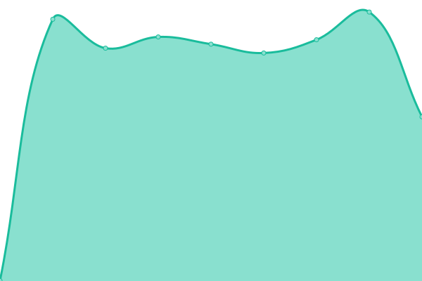

<p align="center">
  
</p>

<h1 align="center">Oblien Status</h1>

<p align="center">
  Real-time availability monitoring for Oblien infrastructure.<br>
  <a href="https://status.oblien.com"><strong>status.oblien.com</strong></a>
</p>

---

<!--live status--> **🟩 All systems operational**

### Monitored Services

<!--start: status pages-->
<!-- This summary is generated by Upptime (https://github.com/upptime/upptime) -->
<!-- Do not edit this manually, your changes will be overwritten -->
<!-- prettier-ignore -->
| URL | Status | History | Response Time | Uptime |
| --- | ------ | ------- | ------------- | ------ |
|  [Oblien API](https://api.oblien.com/health) | 🟩 Up | [oblien-api.yml](https://github.com/oblien/status/commits/HEAD/history/oblien-api.yml) | <details><summary> 548ms</summary><br><a href="https://status.oblien.com/history/oblien-api"></a><br><a href="https://status.oblien.com/history/oblien-api"></a><br><a href="https://status.oblien.com/history/oblien-api"></a><br><a href="https://status.oblien.com/history/oblien-api"></a><br><a href="https://status.oblien.com/history/oblien-api"></a></details> | <details><summary><a href="https://status.oblien.com/history/oblien-api">100.00%</a></summary><a href="https://status.oblien.com/history/oblien-api"></a><br><a href="https://status.oblien.com/history/oblien-api"></a><br><a href="https://status.oblien.com/history/oblien-api"></a><br><a href="https://status.oblien.com/history/oblien-api"></a><br><a href="https://status.oblien.com/history/oblien-api"></a></details>
|  [Workspace Gateway](https://workspace.oblien.com/health) | 🟩 Up | [workspace-gateway.yml](https://github.com/oblien/status/commits/HEAD/history/workspace-gateway.yml) | <details><summary> 575ms</summary><br><a href="https://status.oblien.com/history/workspace-gateway"></a><br><a href="https://status.oblien.com/history/workspace-gateway"></a><br><a href="https://status.oblien.com/history/workspace-gateway"></a><br><a href="https://status.oblien.com/history/workspace-gateway"></a><br><a href="https://status.oblien.com/history/workspace-gateway"></a></details> | <details><summary><a href="https://status.oblien.com/history/workspace-gateway">100.00%</a></summary><a href="https://status.oblien.com/history/workspace-gateway"></a><br><a href="https://status.oblien.com/history/workspace-gateway"></a><br><a href="https://status.oblien.com/history/workspace-gateway"></a><br><a href="https://status.oblien.com/history/workspace-gateway"></a><br><a href="https://status.oblien.com/history/workspace-gateway"></a></details>
|  [SSH Gateway](https://ssh.oblien.com/health) | 🟩 Up | [ssh-gateway.yml](https://github.com/oblien/status/commits/HEAD/history/ssh-gateway.yml) | <details><summary> 537ms</summary><br><a href="https://status.oblien.com/history/ssh-gateway"></a><br><a href="https://status.oblien.com/history/ssh-gateway"></a><br><a href="https://status.oblien.com/history/ssh-gateway"></a><br><a href="https://status.oblien.com/history/ssh-gateway"></a><br><a href="https://status.oblien.com/history/ssh-gateway"></a></details> | <details><summary><a href="https://status.oblien.com/history/ssh-gateway">100.00%</a></summary><a href="https://status.oblien.com/history/ssh-gateway"></a><br><a href="https://status.oblien.com/history/ssh-gateway"></a><br><a href="https://status.oblien.com/history/ssh-gateway"></a><br><a href="https://status.oblien.com/history/ssh-gateway"></a><br><a href="https://status.oblien.com/history/ssh-gateway"></a></details>
|  [Edge Network](https://edge.oblien.com/health) | 🟩 Up | [edge-network.yml](https://github.com/oblien/status/commits/HEAD/history/edge-network.yml) | <details><summary> 550ms</summary><br><a href="https://status.oblien.com/history/edge-network"></a><br><a href="https://status.oblien.com/history/edge-network"></a><br><a href="https://status.oblien.com/history/edge-network"></a><br><a href="https://status.oblien.com/history/edge-network"></a><br><a href="https://status.oblien.com/history/edge-network"></a></details> | <details><summary><a href="https://status.oblien.com/history/edge-network">100.00%</a></summary><a href="https://status.oblien.com/history/edge-network"></a><br><a href="https://status.oblien.com/history/edge-network"></a><br><a href="https://status.oblien.com/history/edge-network"></a><br><a href="https://status.oblien.com/history/edge-network"></a><br><a href="https://status.oblien.com/history/edge-network"></a></details>

<!--end: status pages-->

---

### Architecture

```
GitHub Actions (cron) → Health checks → history/summary.json → Custom status page (GitHub Pages)
                                     → GitHub Issues (auto-created on downtime)
```

| Component        | Purpose                                             |
| ---------------- | --------------------------------------------------- |
| `custom-site/`   | Custom dark status page served at status.oblien.com |
| `history/`       | Raw uptime data and response time logs              |
| `.upptimerc.yml` | Monitoring configuration (endpoints, intervals)     |

### License

Code: [MIT](./LICENSE) · Data: [ODbL](https://opendatacommons.org/licenses/odbl/1-0/)
